# 31/22 EDO Retuner plugin for Musescore 2 / 3

Musescore plugin to automatically retune notes in [31-EDO](https://en.wikipedia.org/wiki/31_equal_temperament)
and [22-edo](https://en.wikipedia.org/wiki/22_equal_temperament)


## Usage

- Download the QML files and put them in the plugins folder.

- To retune the entire score as is, run the plugin located in Plugins > 31-TET / 22-TET.

- To only retune selected notes, make a selection before running the plugin.

--------

### Accidentals (31 edo)

#### Ups and Downs notation (diatonic enharmonic equivalent)

> Plugin file:
> https://github.com/euwbah/musescore-n-tet-plugins/blob/master/31-TET.qml

In ups and downs notation mode, these are the accidentals used by the
plugin. They can be found in the [advanced palette](https://musescore.org/en/handbook/palettes-and-workspaces#workspaces).

| Diesis steps | Accidental |
| ---: | :-----:|
| -5  | 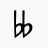 |
| -4  |   |
| -3  | 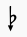  |
| -2  | 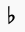  |
| -1  | 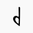 or 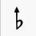 |
| 0   | 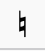 |
| +1  | 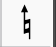 or 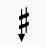 |
| +2  | 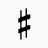  |
| +3  | 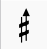 |
| +4  | 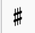  |
| +5  |   |

> Important: This notation differs from the more conventional meantone notation
> which uses quarter-tone accidentals instead.
>
> The benefits of using this notation over meantone is that it allows for proper
> spelling of notes and chords in all 31 keys as it still supports enharmonic diatonic-tone equivalents
> by means of the double flat and double sharp accidentals.

#### 1/4-comma meantone approximation (quarter-tone accidentals)

> Plugin file:
> https://github.com/euwbah/musescore-n-tet-plugins/blob/master/31-TET-Meantone.qml

When using the meantone version of the plugin, these are the accidentals used by the plugin.

| Diesis steps | Accidental |
| ---: | :-----:|
| -4  |  |
| -3  |   |
| -2  |   |
| -1  | 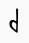 |
| 0   |  |
| +1  | 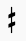 |
| +2  |   |
| +3  |   |
| +4  |   |

### Accidentals (22 edo)

#### Superpyth Ups and Downs

> Plugin file:
> https://github.com/euwbah/musescore-n-tet-plugins/blob/master/22-TET.qml

Natural notes in this system are based off the chain of fifths F-C-G-D-A-E-B.
Each fifth is 13 steps of 22 edo (about 709 cents).
The distance between B-C and E-F is 1 step of 22 edo (about 54.5 cents)

| Diesis steps | Accidental |
| ---: | :----- |
| -4  |  (double flats are also -4 for simplicity's sake)  |
| -3  |   |
| -2  |   |
| -1  |  |
| 0   |  |
| +1  |  |
| +2  |   |
| +3  |  |
| +4  |  (double sharps are also +4 for simplicity's sake) |

### Key signatures support

As MuseScore doesn't completely support
[custom key signatures](https://musescore.org/en/handbook/key-signatures#custom-key-signatures),
any custom key signature can't be read by the plugin, at least for now.

If you want to create a microtonal key signature and have it affect the
playback, you have to explicitly declare the custom key signature using
system/staff text containing accidental code, on top of creating and placing
the visual custom key signature.

Also, in order for the up/down step transposition feature to work properly,
**all** key signatures, even standard ones, must be accompanied with system/staff
text key signature information.

You can indicate custom key signatures by entering the key signature using
System Text or Staff Text.

- Use **System Text** (`Ctrl` + `Shift` + `T`) if you want the key signature code to affect
  all staves from there onwards
- Use **Staff Text** (`Shift` + `T`) if you only want the code to affect the staff that it is on.
  This is especially useful when using custom **local** key signatures!
- Remember to make the custom key signature code invisible! (Press `V` to toggle visibility)

Key signature code syntax:

1. Start with a dot `.`
2. Put the textual representation of the accidental for the note **C** using the [accidental code](#accidental-code)
3. Put another dot `.`
4. Put the required accidental for **D**
5. Repeat from **C** thru **B**

Finally, you should have be seven dots (`.`) in total.

Natural accidentals are denoted by leaving the space blank, or using any other character
that does not represent an accidental.

Spaces/newlines can be placed before or after the dots to improve readability.

**Example:**
Ab-down major in 31 edo's ups-and-downs is written like this: `.v.bv.bv.v.v.bv.bv`
representing the key signature of Cv, Dbv, Ebv, Fv, Gv, Abv, Bbv.

C major in 22 edo's ups-and-downs is written like this: `.0.0.v.0.0.v.v`
representing the key signature of C, D, Ev, F, G, Av, Bv. (The `0`s represent placeholders,
you can also choose to put nothing between the dots)

> Note that explicit accidentals will still take precedence over the
> declared custom key signature, behaving exactly the same way a key signature
> would.

#### Accidental Code

| Accidental | Textual representation |
| ----: | :----: |
|  | `bb` |
|  | `db`  |
|  | `bv`  |
|    | `b`  |
|    | `b^` |
|    | `v` |
|  | `d` |
|  | Leave blank / any other character  |
|  | `+` |
|  | `^` |
|  | `#v` |
|  | `#`  |
|  | `#^`  |
|  | `#+`  |
|  | `x`  |

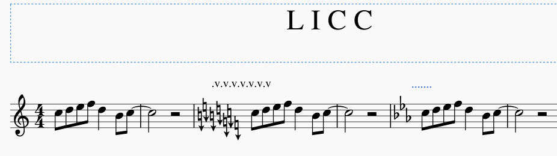

## Known issues:

- CRITICAL ISSUE: note tuning caps at +/- 200 cents, but 4 steps in 22 edo exceeds this.
  TODO: alter PlayEvents to transpose notes in steps of 100 cents to fix this. Will fix soon.

- Cross staff notation doesn't work properly, the accidentals in the staff that the notes are transferred to
  do not affect the notes that originally belonged in that staff that the notes were transferred to.
  Please refrain from using cross-staff notation, or submit a PR for this fix.

- Accidentals of grace notes that comes after rather than before are handled as if they were before, and also
  not in the right order. This causes huge problems when transposing.
  Please refrain from using grace notes that attach after main notes, or submit a PR for this fix.

- The plugin tries its best to handle chords with pairs of mirrored notes that
  share the same line (e.g. an F and F# on the same staff line) but due to plugin API
  limitations and the way MuseScore natively handles them, its behavior is somewhat janky.
  When dealing with them, ALWAYS use explicit accidentals on the mirrored notes to
  ensure the Accidentals are all registered correctly. This way it is clear to read
  and also for the plugin to read and understand which accidentals belong to which
  notes.
  - The exact order the plugin reads and performs operations on its notes of each chord segment are as follows:
    1. grace notes (in similar fashion to step 2)
    2. For notes in the same chord, left to right, then bottom to top, as they appear in the score.

-------------

## Note to self / developers:

### IMPORTANT basic info on undocumented Plugin API mechanics!

CURSOR REWIND MECHANICS ARE WEIRD!
  - If rewinding to start of selection `cursor.rewind(1)`, set `cursor.staffIdx` and `cursor.voice` after
    `rewind(1)`.
  - If rewinding to start of score, IT IS STILL NECESSARY TO CALL `cursor.rewind(1)`, then set `staffIdx` and `voice`,
    THEN call `cursor.rewind(0)` AFTERWARDS.


It is an invalid operation to set cursor voice/staffIdx without rewinding.


IMPORTANT! DO NOT USE `===` or `!==` to compare equivalence of accidentalType to Accidental enum values.


When assigning `Note.accidentalType` to variables or passing it into a function as a parameter,
ensure that the value read is in integer format to invoke the getter of the
integer enumeration instead of the stringified value of the accidental type.

```js
noteData.explicitAccidental = note.accidentalType;
console.log(explicitAccidental); // NATURAL_ARROW_UP
noteData.explicitAccidental = 0 + note.accidentalType;
console.log(explicitAccidental); // 11 (enumerated value equivalent of NATURAL_ARROW_UP)

console.log(Accidental.NATURAL_ARROW_UP); // 11

console.log(note.accidentalType); // NATURAL_ARROW_UP
console.log(0 + note.accidentalType) // 11
```


It's important to clear the accidental first before assigning (in general).
  - If existing accidental type is a non-standard accidental, and the new assigned accidental type is standard,
    the new assigned accidental type would affect the tpc of the note, but
    the existing non-standard accidental still displays instead of the new one.

```js
note.line = 0;
note.tpc = 13; // F natural
note.accidentalType = Accidental.NATURAL_ARROW_UP; // set to non-standard accidental
note.accidentalType = Accidental.SHARP; // note will still appear with NATURAL_SHARP_UP, but it will sound as SHARP.
console.log(note.tpc); // 20 (F sharp)
console.log(note.accidentalType); // it is STILL NATURAL_ARROW_UP...

note.line = 0;
note.tpc = 13; // F natural
note.accidentalType = Accidental.NATURAL_ARROW_UP; // set to non-standard accidental
note.accidentalType = Accidental.NONE; // Clear accidental
note.accidentalType = Accidental.SHARP; // note will still appear with NATURAL_SHARP_UP, but it will sound as SHARP.
console.log(note.tpc); // 20 (F sharp)
console.log(note.accidentalType); // SHARP (correct)
```


### Plugin Information

- Transposition plugins are now using stateless accidentals, scanning accidentals on the fly.
  - Works should be done to make the tuning plugins use stateless accidentals too.
    Makes it way easier to think and removes a lot of possible state errors.

> The most completely documented / commented variant of the plugin is
> in the 31-TET ups and downs notation plugins for both tuning and transposing variants.
> The rest are variants of the 31 up-downs code with certain constants and values changed.

##### Important properties:

**IMPORTANT `Note.accidental` vs. `Note.accidentalType`**:
: `accidental` represents the accidental Element object itself,
: whereas, accidentalType is a value of the Accidental enumeration!!

`tpc`
: Tonal pitch class. Circle of fifths starting from Fbb with value of -1.
: Cbb = 0, Gbb = 1, Dbb = 2, etc...

`segment.annotations[idx].textStyleType`
: 22 if Staff Text,
: 21 if System Text

`segment.annotations[idx].text`
: Contains given text

`MuseScore.curScore.selection.elements`
: An array of elements containing individual elements the user has selected
: with ctrl + click. Especially useful for applying an action to certain notes in particular.


#### Musescore Enums

##### Accidentals (used in project)

```
Accidental.none                (no explicit accidental)
Accidental.SHARP2              x
Accidental.SHARP_SLASH4        #+
Accidental.SHARP_ARROW_UP      #^
Accidental.SHARP               #
Accidental.SHARP_ARROW_DOWN    #v
Accidental.SHARP_SLASH         +
Accidental.NATURAL_ARROW_UP    ^
Accidental.NATURAL             natural
Accidental.NATURAL_ARROW_DOWN  v
Accidental.MIRRORED_FLAT       d
Accidental.FLAT_ARROW_UP       b^
Accidental.FLAT                b
Accidental.FLAT_ARROW_DOWN     bv
Accidental.MIRRORED_FLAT2      db
Accidental.FLAT_2              bb
```

#### Custom object types in up/down step transposition plugins

##### Key signature object:

```
{
  c: {steps: <number of diesis offset>, type: Accidental enum value}
  d: ...
  e: ...
  etc...
}
```

##### Accidental object:

```
{
  offset: number of diesis offset,
  type: accidental type as Accidental enum value
}
```

##### Enharmonics object:

```
{
 above: {baseNote: 'a' through 'g', offset: diesis offset}
 below: {baseNote: 'a' through 'g', offset: diesis offset}
}
```

##### Note pitch data:

```
{
  baseNote: a string from 'a' to 'g',
  line: the note.line property referring to height of the note on the staff
  tpc: the tonal pitch class of the note (as per note.tpc)
  tick: the tick position of the note
  explicitAccidental: Accidental enum of the explicit accidental attatched to this note (if any)
  implicitAccidental: Accidental enum of the implicit accidental of this note (non null)
                      (if explicitAccidental exists, implicitAccidental = explicitAccidental)
  diesisOffset: the number of edo steps offset from the base note this note is
}
```

## [Changelog](./CHANGELOG.md)

### TODO:

- Handle cross-staff notation (ctrl + shift + up/down in connected staves, e.g. grand staff) where note appears to be in another staff
  other than the cursor's staffIdx. Currently, accidentals in the cross-staff do not work on the notes that came from another staff.
  See Add Courtesy Accidentals plugin for how to do this
- Implement porcupine notation for 22-edo (D-E-F-G-A-B-C-D = sssLsss)
- Implement toggling between enharmonic equivalences
- Don't hard-code frequencies, just use a dictionary of exponential operations instead
