# Microtonal plugin for Musescore 3.4+: Retune + Transpose in almost any EDO.


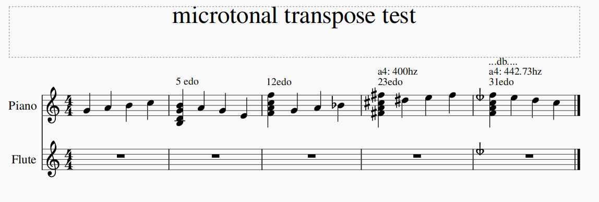

## Features

- Retuning notes to match any [supported edo](#appendix-a-list-of-supported-edos-according-to-sharpness-classification) of choice
  - Special thanks to [Flora Canou](https://github.com/FloraCanou/musescore-n-tet-plugins) for providing the generalized method for evaluating cent offsets for any EDO.
- Support for key signatures via [Key signature annotations](#key-signatures)
- Transposing individual notes/selections by 1 EDO step while automatically assigning accidentals
- Tuning, key signatures, and reference pitches can be changed mid score;
- Each staff can be assigned its own tunings, key signatures, and reference pitches simultaneously.
- Based on [Kite Giedraitis' ups and downs notation](http://tallkite.com/misc_files/notation%20guide%20for%20edos%205-72.pdf)

## Support me

Support this plugin + fund my xenharmonic music creation and research.
Any amount would be greatly appreciated!

[](https://github.com/sponsors/euwbah)

## Quick start

**Make sure you are using MuseScore 3.4 or newer. The plugin will not work in previous versions**

### 1. [Download the project](https://github.com/euwbah/musescore-n-tet-plugins/archive/master.zip) and unzip into [MuseScore's plugins directory](https://musescore.org/en/handbook/3/plugins#windows)

### 2. [Enable](https://musescore.org/en/handbook/3/plugins#enable-disable-plugins) the following plugins

- `tune n-edo`: Tunes the selected notes, or entire score if nothing selected. Notes are not automatically tuned
  as they are entered, so it is important to run this regularly for accurate playback.
- `pitch up` & `pitch down`: Transposes selected notes by 1 edostep, then updates their tuning.
  Equivalent to MuseScore's up/down arrow shortcuts. If you prefer arrow notation over semi/sesqui
  sharp/flat quartertone notation, use `pitch up no dt` & `pitch down no dt` instead.

### 3. Set up keyboard shortcuts for the plugins
(optional, highly recommended for the best experience)

- First, clear/change the default shortcuts that uses the up/down arrow keys.
  You can find these in _Edit -> Preferences -> Shortcuts_. Search for the following shortcut names,
  select them and click the _Clear_ button.
  - _Pitch up or move text or articulation up_
  - _Pitch down or move text or articulation down_
  - _Select string above_
  - _Select string below_
- To define a shortcut for a plugin, go to:  _Plugins -> Plugin Manager -> Select plugin name in the list -> Define Shortcut_.
- Set `tune n-edo` to use `Alt-R`.
- Set `pitch up`/`pitch up no dt` to use the up arrow. This shortcut should only be assigned on either one of the plugins.
- Set `pitch down`/`pitch down no dt` to use the down arrow. This shortcut should only be assigned on either one of the plugins.

### 4. Select a tuning system

Create a System Text (`Ctrl-Shift-T`) and type `___ edo`, fill in the blank with any
of the [supported edo tunings](#appendix-a-list-of-supported-edos-according-to-sharpness-classification). This will
affect all staves/parts from the bar where the text was placed onwards.

If you wish to only change the tuning of
one staff, but not the others, use Staff Text (`Ctrl-T`) instead. You should not place a tuning system change
halfway through a bar.

If a tuning system has not been specified for a part, it defaults to 12 edo.
The text is case-insensitive.

### 5. Annotate key signatures

For each key signature, create one System Text (`Ctrl-Shift-T`) at the start of the same
bar as the key signature, then type `.x.x.x.x.x.x.x`, where each 'x'
represents an [accidental](#accidental-code) applied on the notes C, D, E, F, G, A, and B respectively.
If a note should have no accidental, you can leave it blank or put any other placeholder character.
For example, the key signature for D major can look like: `.#...#...` representing C# and F#.
There should always be 7 dots (`.`) in the key signature annotation. Refer to the
[list of supported key signatures](#accidental-code).

If there are staves which have a separate key signatures from the others,
as in [local key signatures](https://musescore.org/en/handbook/3/key-signatures#add-key-sig-to-one-staff),
or transposing instruments, you can assign a key signature annotation for just that
staff using Staff Text (`Ctrl-T`) instead of System Text.

> :warning: Due to current technical limitations of MuseScore,
**all** key signatures, even standard non-custom ones, must be accompanied by key signature annotations.
>
> :warning: It is necessary to adjust the key signature annotations when toggling between concert and tranposing pitch
  display modes.

If a key signature annotation has not been specified, the plugin assumes that there are no accidentals in the key
signature. The text is case-insensitive.

### 6. Annotate transposing instruments

If a part uses a transposing instrument, create a Staff Text (`Ctrl-T`) at
the start of the first bar of the part, or at the start of the bar where an instrument change to
a transposing instrument of a different transposition is performed. In this staff text,
type `t: Bb` for Bb instruments, `t: Eb` for Eb instruments, etc. All fifth-based transpositions
are supported - meaning you can use the accidentals `x`, `#`, `b`, `bb`.

This step is required as MuseScore implements transpositions as offsets in 12-edo.
Placing the transposition annotation will correct the offset into the current tuning system.
Note that if [Concert Pitch](https://musescore.org/en/handbook/3/concert-pitch) display mode is active,
the transposition annotation will not take effect and all parts will be treated as C instruments.

If no transposition annotations were specified, the part is assumed to be a C instrument.
The text is case-insensitive.

### 7. Select a reference pitch

This step is optional and reference pitch is defaulted to `A4: 440 Hz`.

To change reference pitch for all parts, create a System Text (`Ctrl-Shift-T`) and
type `{note}: {f} Hz`:
  - `{note}` represents any note A through G followed by
    its octave without spaces. Middle C is written as `C4`.
  - `{f}` represents the frequency of the above reference note in Hertz
  - the _'Hz'_ is optional

To change reference pitch for only one part, use Staff Text (`Ctrl-T`) instead.
The text is case-insensitive.

### 8. Done!

You can now use the up and down arrow keys to adjust a note according
to the tuning system of choice! Here are some things to take note of:
- You can make the text annotations invisible by selecting them and pressing `V`.
- Make sure each System/Staff Text only contains one modifier; don't combine
  tuning selection and key signature annotation in one Text element.
- Remember to run the `tune n-edo` plugin regularly to update the pitches of
  notes that are not yet tuned/transposed.

------------------------

## Accidental Code

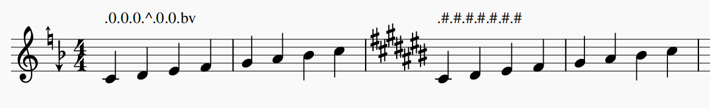

| Accidental | Textual representation |
| ----: | :---- |
| 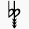  | `bbv3` |
| 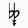  | `bbv2` |
| 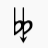    | `bbv` or `bbv1` |
|            | `bb`   |
| 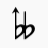      | `bb^` or `bb^1` |
| 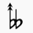    | `bb^2` |
| 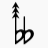    | `bb^3` |
|            | `db` or `bd` |
| 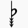          | `bv3`  |
| 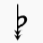          | `bv2`  |
| 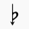            | `bv` or `bv1` |
|                    | `b`  |
| 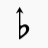              | `b^` or `b^1` |
| 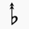            | `b^2` |
| 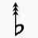            | `b^3` |
| 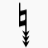                | `v3` |
|                 | `v2` |
| 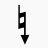                   | `v` or `v1` |
|            | `d` |
|                 | Leave blank / any other character  |
|           | `+` |
| 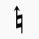                    | `^` or `^1` |
| 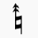                   | `^2` |
| 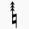                   | `^3` |
| 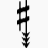          | `#v3` |
| 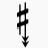          | `#v2` |
| 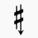           | `#v` or `#v1` |
|                   | `#`  |
| 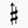             | `#^` or `#^1` |
| 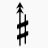           | `#^2`  |
| 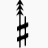           | `#^3`  |
| 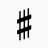          | `#+` or `+#` |
| 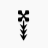    | `xv3` |
| 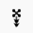   | `xv2` |
| 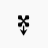   | `xv` or `xv1` |
|            | `x` |
|       | `x^` or `x^1` |
| 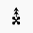    | `x^2` |
| 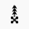    | `x^3` |

-----------------

## Notation system

The plugin follows notation standards as per [Kite Giedraitis' ups and downs notation](http://tallkite.com/misc_files/notation%20guide%20for%20edos%205-72.pdf),
which is a generalized system for notating any EDO.

Here is a brief summary of the contents of the document:

### Tuning of nominals C D E F G A B

In this system, the nominals F C G D A E B are tuned according to a chain of **best fifths**,
which is the best representation of the perfect 3:2 just fifth that the EDO has to offer.\
The exact pitches of the notes are calculated based on the frequency of the reference note, which is defined by the
reference frequency selector, or A4: 440 Hz by default.

<details>
  <summary><em> How to calculate an EDO's best fifth? </em></summary>

  The number of steps a fifth is in x-edo = `round(x * log2(3/2))`

  `3/2` represents the frequency ratio of a fifth in just intonation.\
  `log2(3/2)` represents how many octaves are there in a fifth (approx 0.584962)\
  `x * log2(3/2)` represents how many steps of x-edo are there in a fifth\
  `round()` rounds it up/down to the nearest whole edostep.

  E.g's:
  - The best fifth in 12 edo is 7 steps. Thus, the distance between F-C, C-G, G-D, etc.. is 7 steps of 12 edo.
  - The best fifth in 22 edo is 13 steps. Thus, the distance between C-G, etc.. is 13 steps of 22 edo.

</details>


### Tuning of regular pythagorean accidentals

   

The standard accidentals Double Flat (`bb`), Flat (`b`), Sharp (`#`), Double Sharp (`x`) are based on
the circle of fifths.

To give an example in 12-edo, going 7 fifths up from C4 yields C4-G4-D5-A5-E6-B6-F#7-C#8.\
A best fifth in 12-edo is 7 steps of 12 edo.\
Going up 7 fifths in 12-edo yields a total of 7*7 = 49 steps (which brings C4 to C#8)\
Going down 4 octaves to bring C#8 down to C#4 reduces the steps by 4 * 12 = 48 steps.\
Thus, a sharp symbol in 12-edo is defined as going up 49 steps, then down 48 steps, yielding a +1 step difference.

The number of edosteps a sharp symbol raises the pitch by is known as an EDO's **sharpness** value,
also known as the size of the **apotome**.\
Thus, the sharpness of 12-edo is 1, which classifies it as a **sharp-1** EDO.\
Consequently, a double sharp raises the pitch by 2 times of the sharpness value, thus 2 steps.\
A flat lowers the pitch by the sharpness value, thus lowering it by 1 step.\
A double flat lowers the pitch by 2 times of the sharpness value, thus lowering it by 2 steps.

To give another example in 23-edo:
A best fifth in 23-edo is 13 edosteps.\
Going up 7 fifths (From C4 to C#8) = going up 7 * 13 = 91 steps.\
Going down 4 octaves (From C#8 to C#4) = going down 4 * 23 = 92 steps.\
Thus, a sharp symbol in 23-edo is defined as going up 91 steps and down 92 steps, yielding a -1 step difference.\
A sharp symbol in 23-edo, surprisingly, __lowers__ the pitch by 1 step, instead of raising it.\
Consequently, the flat symbol raises the pitch by 1 step.\
The apotome size of 23-edo is -1, which classifies it as a **flat-1** EDO.

Note: in EDOs such as 7, 14 and 21, the sharp and flats do not raise nor lower the pitch, and thus
they are known as **perfect** EDOs, i.e. **Sharp-0**.

[Here is the full list of supported EDOs and their respective sharpness values.](#appendix-a-list-of-supported-edos-according-to-sharpness-classification)

The plugin only supports up to 2 flats and sharps. Triple flats and sharps and not supported as
MuseScore does not provide these accidentals.

### Tuning of up/down arrows

  

Arrows on the natural, sharp/flat, double sharp/flat accidentals offsets the pitch of the note by
the same number of steps of the EDO as there are arrows on the accidental.

An upwards arrow always raises the pitch by 1 step, regardless of whether the sharp symbol raises or lowers the pitch of the
note. Vice versa, a downwards arrow always lowers the pitch by 1 step.

Thus the interval between C and C^ is +1 step. And so is the interval between C# and C#^, Cbv and Cb, etc..

A maximum of 3 arrows are allowed on each accidental, as MuseScore currently does not provide accidentals
with more than 3 arrows. Due to these limitations, and with the help of quartertone accidentals, the plugin
can only handle EDOs with a sharpness rating of up to 8.

[Here is the full list of supported EDOs and their respective sharpness values.](#appendix-a-list-of-supported-edos-according-to-sharpness-classification)

The up/down arrow accidentals this plugin uses are Helmholtz-Ellis Just Intonation accidentals.\
Gould arrow quartertone symbols look very similar to the single up/down arrow Helmholtz-Ellis accidentals,
and may be used interchangeably, although the plugin defaults to Helmholtz-Ellis when transposing.
To differentiate the two, Gould arrow symbols appear slightly larger than the Helmholtz-Ellis ones.

### Tuning of quartertone (semisharp/semiflat) accidentals

   

Stein-Zimmermann quartertone accidentals represent an offset of half or one-and-a-half times of the standard sharpness
of the accidental. They only work when the EDO has an even-number sharpness rating which can be divided
by 2 evenly.

For example, in 31-edo, where the sharpness rating is sharp-2:
-  lowers the pitch by 1.5 x 2 = -3 steps
-  lowers the pitch by 0.5 x 2 = -1 step
-  raises the pitch by 0.5 x 2 = +1 step
-  raises the pitch by 1.5 x 2 = +3 steps


--------


## Known issues:

- Cross staff notation doesn't work properly, the accidentals in the staff that the notes are transferred to
  do not affect the notes that originally belonged in that staff that the notes were transferred to.
  Please refrain from using cross-staff notation, or submit a PR for this fix.

- Accidentals of grace notes that comes after rather than before are handled as if they were before, and also
  not in the right order. This causes huge problems when transposing.
  Please refrain from using grace notes that attach after main notes, or submit a PR for this fix.

- The plugin tries its best to handle chords with pairs of mirrored notes that
  share the same line (e.g. an F and F# on the same staff line) but due to plugin API
  limitations and the way MuseScore natively handles them, its behavior is somewhat janky.
  When dealing with them, ALWAYS use explicit accidentals on the mirrored notes to
  ensure the Accidentals are all registered correctly. This way it is clear to read
  and also for the plugin to read and understand which accidentals belong to which
  notes.
  - The exact order the plugin reads and performs operations on its notes of each chord segment are as follows:
    1. grace notes (in similar fashion to step 2)
    2. For notes in the same chord, left to right, then bottom to top, as they appear in the score.

-------------

## Appendix A: List of supported EDOs according to sharpness classification.

| Sharpness (steps of an apotome) | EDOs |
| -------:  | :------- |
| flat-2 | 4, 11 |
| flat-1 | 2, 9, 16, 23 |
| perfect | 7, 14, 21, 28, 35 |
| sharp-1 | 5, 12, 19, 26, 33, 40, 47 |
| sharp-2 | 3, 10, 17, 24, 31, 38, 45, 52 |
| sharp-3 | 1, 8, 15, 22, 29, 36, 43, 50, 57, 64 |
| sharp-4 | 6, 13, 20, 27, 34, 41, 48, 55, 62, 69, 76 |
| sharp-5 | 18, 25, 32, 39, 46, 53, 60, 67, 74, 81, 88 |
| sharp-6 | 30, 37, 44, 51, 58, 65, 72, 79, 86, 93, 100 |
| sharp-7 | 42, 49, 56, 63, 70, 77, 84, 91, 98, 105 |
| sharp-8 | 54, 61, 68, 75, 82, 89, 96, 103, 110, 117 |

---------------

## Note to self / developers:

### IMPORTANT basic info on undocumented Plugin API mechanics!

CURSOR REWIND MECHANICS ARE WEIRD!
  - If rewinding to start of selection `cursor.rewind(1)`, set `cursor.staffIdx` and `cursor.voice` after
    `rewind(1)`.
  - If rewinding to start of score, IT IS STILL NECESSARY TO CALL `cursor.rewind(1)`, then set `staffIdx` and `voice`,
    THEN call `cursor.rewind(0)` AFTERWARDS. \
    Apparently, based on the (add courtesy accidentals)[https://github.com/heuchi/courtesyAccidentals/blob/master/addCourtesyAccidentals.qml#L160] plugin, `cursor.track` has to be set to 0 in order for `cursor.rewind(0)` to work.


It is an invalid operation to set cursor voice/staffIdx without rewinding.

IMPORTANT! DO NOT USE `===` or `!==` to compare equivalence of accidentalType to Accidental enum values.

When assigning `Note.accidentalType` to variables or passing it into a function as a parameter,
ensure that the value read is in integer format to invoke the getter of the
integer enumeration instead of the stringified value of the accidental type.

```js
noteData.explicitAccidental = note.accidentalType;
console.log(explicitAccidental); // NATURAL_ARROW_UP
noteData.explicitAccidental = 0 + note.accidentalType;
console.log(explicitAccidental); // 11 (enumerated value equivalent of NATURAL_ARROW_UP)

console.log(Accidental.NATURAL_ARROW_UP); // 11

console.log(note.accidentalType); // NATURAL_ARROW_UP
console.log(0 + note.accidentalType) // 11
```

There is a very specific method to update an existing note's accidental
such that there are minimal race/state errors. Refer to the ]
[`setAccidental()`](https://github.com/euwbah/musescore-n-tet-plugins/blob/56aa8cc3697ac04d31eff82ba59edc177a55d88f/pitch%20down.qml#L3457) function.

`Note.accidental` and `Note.accidentalType` properties of transposed notes that contain new accidental values of standardized
accidentals are not present in a new cursor instance. The plugin uses tpc as a workaround, but it makes it impossible to
determine if a prior note's accidental was implicit or explicit.\
[See this forum post here.](https://musescore.org/en/node/305977)

##### Important properties:

**IMPORTANT `Note.accidental` vs. `Note.accidentalType`**:
: `accidental` represents the accidental Element object itself,
: whereas, accidentalType is a value of the Accidental enumeration!!

`tpc`
: Tonal pitch class. Circle of fifths starting from Fbb with value of -1.
: Cbb = 0, Gbb = 1, Dbb = 2, etc...

`segment.annotations[idx].textStyleType`
: 22 if Staff Text,
: 21 if System Text

`segment.annotations[idx].text`
: Contains given text

`MuseScore.curScore.selection.elements`
: An array of elements containing individual elements the user has selected
: with ctrl + click. Especially useful for applying an action to certain notes in particular.


#### Musescore Enums

##### Accidentals (used in project)

```
Accidental.NONE                         (no explicit accidental)
Accidental.DOUBLE_SHARP_ONE_ARROW_UP          x^
Accidental.DOUBLE_SHARP_TWO_ARROWS_UP         x^2
Accidental.DOUBLE_SHARP_THREE_ARROWS_UP       x^3
Accidental.SHARP2                             x
Accidental.DOUBLE_SHARP_ONE_ARROW_DOWN        xv
Accidental.DOUBLE_SHARP_TWO_ARROWS_DOWN       xv2
Accidental.DOUBLE_SHARP_THREE_ARROWS_DOWN     xv3
Accidental.SHARP_SLASH4                       #+
Accidental.SHARP_ONE_ARROW_UP                 #^
Accidental.SHARP_TWO_ARROWS_UP                #^2
Accidental.SHARP_THREE_ARROWS_UP              #^3
Accidental.SHARP                              #
Accidental.SHARP_ONE_ARROW_DOWN               #v
Accidental.SHARP_TWO_ARROWS_DOWN              #v2
Accidental.SHARP_THREE_ARROWS_DOWN            #v3
Accidental.SHARP_SLASH                        +
Accidental.NATURAL_ONE_ARROW_UP               ^
Accidental.NATURAL_TWO_ARROWS_UP              ^2
Accidental.NATURAL_THREE_ARROWS_UP            ^3
Accidental.NATURAL                            natural
Accidental.NATURAL_ONE_ARROW_DOWN             v
Accidental.NATURAL_TWO_ARROWS_DOWN            v2
Accidental.NATURAL_THREE_ARROWS_DOWN          v3
Accidental.MIRRORED_FLAT                      d
Accidental.FLAT_ONE_ARROW_UP                  b^
Accidental.FLAT_TWO_ARROWS_UP                 b^2
Accidental.FLAT_THREE_ARROWS_UP               b^3
Accidental.FLAT                               b
Accidental.FLAT_ONE_ARROW_DOWN                bv
Accidental.FLAT_TWO_ARROWS_DOWN               bv2
Accidental.FLAT_THREE_ARROWS_DOWN             bv3
Accidental.MIRRORED_FLAT2                     db
Accidental.DOUBLE_FLAT_ONE_ARROW_UP           bb^
Accidental.DOUBLE_FLAT_TWO_ARROWS_UP          bb^2
Accidental.DOUBLE_FLAT_THREE_ARROWS_UP        bb^3
Accidental.FLAT2                              bb
Accidental.DOUBLE_FLAT_ONE_ARROW_DOWN         bbv
Accidental.DOUBLE_FLAT_TWO_ARROWS_DOWN        bbv2
Accidental.DOUBLE_FLAT_THREE_ARROWS_DOWN      bbv3
```

#### Custom object types in up/down step transposition plugins

##### Key signature object:

```
{
  c: {steps: <number of diesis offset>, type: Accidental enum value}
  d: ...
  e: ...
  etc...
}
```

##### Accidental object:

```
{
  offset: number of diesis offset,
  type: accidental type as Accidental enum value
}
```

##### Enharmonics object:

```
{
 above: {baseNote: 'a' through 'g', offset: diesis offset}
 below: {baseNote: 'a' through 'g', offset: diesis offset}
}
```

##### Note pitch data:

```
{
  baseNote: a string from 'a' to 'g',
  line: the note.line property referring to height of the note on the staff
  tpc: the tonal pitch class of the note (as per note.tpc)
  tick: the tick position of the note
  explicitAccidental: Accidental enum of the explicit accidental attatched to this note (if any)
  implicitAccidental: Accidental enum of the implicit accidental of this note (non null)
                      (if explicitAccidental exists, implicitAccidental = explicitAccidental)
  diesisOffset: the number of edo steps offset from the base note this note is
}
```

## [Changelog](./CHANGELOG.md)

### TODO:

- Handle cross-staff notation (ctrl + shift + up/down in connected staves, e.g. grand staff) where note appears to be in another staff
  other than the cursor's staffIdx. Currently, accidentals in the cross-staff do not work on the notes that came from another staff.
  See Add Courtesy Accidentals plugin for how to do this
- Implement toggling between enharmonic equivalences
- Make tune n-edo plugin use stateless accidental detection also.
